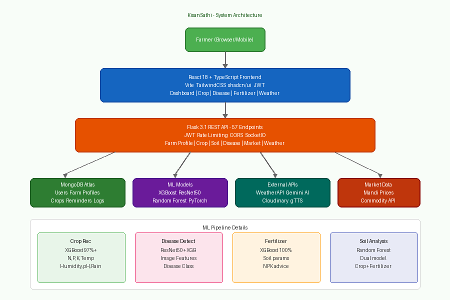

# KisanSathi — Smart Farm Decision Support System

> HackInMotion 2026 | Theme: Agriculture & Farming | Team: RICR-HIM-1054

[](https://python.org)
[](https://reactjs.org)
[](https://flask.palletsprojects.com)
[](https://mongodb.com)

## Problem Statement

Indian farmers lack real-time, personalized decision support. KisanSathi solves this by combining ML-based crop recommendations, real weather data, disease detection, and market price insights into a single unified dashboard — tailored to each farmer's soil, location, and crop history.

## Features

| Feature | Status | Description |
|---|---|---|
| Farm Profile | ✅ | Location, land size, soil type, active crops |
| ML Crop Recommendation | ✅ | XGBoost model — Manual, By Location, Per Month |
| Weather + Irrigation | ✅ | Real WeatherAPI data, farm-profile-specific irrigation advice |
| Disease Detection | ✅ | Image-based plant disease detection (ResNet50 + XGBoost) |
| Fertilizer Recommendation | ✅ | ML-based NPK analysis |
| Soil Analysis | ✅ | Dual-model crop + fertilizer prediction |
| Market Prices | ✅ | Real-time mandi prices via commodity API |
| Unified Dashboard | ✅ | Weather + crop health + market trends in one view |
| Community | ✅ | Farmer groups + messaging |
| Smart Reminders | ✅ | Crop lifecycle reminders |
| Voice Assistant | ✅ | Hindi + English TTS/voice input |
| Livestock Health | ✅ | Disease detection for cattle |

## Tech Stack

### Frontend
- React 18 + TypeScript + Vite
- TailwindCSS + shadcn/ui
- JWT authentication

### Backend
- Python 3.14 + Flask 3.1
- Flask-JWT-Extended, Flask-SocketIO, Flask-Limiter
- ML: XGBoost, scikit-learn, PyTorch (ResNet50, MobileNetV2)

### Data & AI
- MongoDB Atlas (primary database)
- Google Gemini 2.5 Flash (AI explanations)
- WeatherAPI (real-time weather)
- Cloudinary (image storage)
- gTTS (text-to-speech)

## Project Structure

```
HackInMotion-RICR-HIM-1054/
├── kisansathi/
│   ├── backend/                  # Flask API server
│   │   ├── app_enhanced.py       # Main application (57 endpoints)
│   │   ├── utils/                # ML models + utilities
│   │   ├── models/               # Trained .pkl / .pth model files
│   │   └── .env.example          # Environment template
│   ├── frontend/
│   │   └── pixel-perfect-copy/   # React + TypeScript frontend
│   │       └── src/
│   │           ├── pages/        # 30 page components
│   │           ├── components/   # Reusable UI components
│   │           └── utils/        # API utilities
│   ├── pet-health-advisor/       # Pet health sub-module
│   └── docs/                     # Architecture, API docs, requirements
└── README.md
```

## Quick Start

### Backend

```bash
cd kisansathi/backend
cp .env.example .env          # Fill in your API keys
pip install -r requirements.txt
python app_enhanced.py        # Runs on http://localhost:5000
```

### Frontend

```bash
cd kisansathi/frontend/pixel-perfect-copy
cp .env.example .env          # Set VITE_API_URL=http://localhost:5000
npm install --legacy-peer-deps
npm run dev                   # Runs on http://localhost:8080
```

## API Documentation

See [`kisansathi/docs/API_DOCUMENTATION.md`](kisansathi/docs/API_DOCUMENTATION.md) for full endpoint reference.

Key endpoints:

| Method | Endpoint | Description |
|---|---|---|
| GET | `/api/health` | Health check |
| POST | `/api/auth/register` | Register farmer |
| POST | `/api/auth/login` | Login |
| GET/POST | `/api/farm-profile` | Farm profile CRUD |
| POST | `/api/recommendations/crop` | ML crop recommendation |
| POST | `/api/recommendations/advanced-crop` | Location + season based |
| POST | `/api/soil/analyze` | Soil analysis |
| POST | `/api/fertilizer/recommend` | Fertilizer recommendation |
| POST | `/api/disease-predict` | Plant disease from image |
| GET | `/api/weather/{location}` | Real-time weather |
| GET | `/api/market/prices` | Live mandi prices |
| GET | `/api/dashboard/unified` | Unified dashboard data |

## ML Models

| Model | Algorithm | Accuracy | Use Case |
|---|---|---|---|
| Crop Recommendation | XGBoost | 97%+ | NPK + weather → crop |
| Fertilizer Recommendation | XGBoost | 100% | Soil params → fertilizer |
| Soil Analysis | Random Forest | 90%+ | Soil type → crop + fertilizer |
| Disease Detection | ResNet50 + XGBoost | 85%+ | Image → disease |
| Seasonal Crop | Random Forest | 88%+ | Season + month → crops |

## System Architecture



See [`kisansathi/docs/SYSTEM_ARCHITECTURE.md`](kisansathi/docs/SYSTEM_ARCHITECTURE.md) for detailed architecture.

## Team — RICR-HIM-1054

| Member | Role |
|---|---|
| Sumit Dangi | Frontend + Integration |
| Shivam | Backend + ML |
| Bhoomi Kesharwani | Backend + Weather Integration |

## License

MIT — see [LICENSE](kisansathi/LICENSE)
